# YOMU Novel Platform - Entity Relationship Diagram (ERD)

## Overview

This document defines all entities and their relationships for the YOMU novel platform.

## Entity Relationship Diagram

```mermaid
erDiagram
    USER ||--o{ PROFILE : has
    USER ||--o{ USER_ROLE : has
    USER ||--o{ NOVEL : writes
    USER ||--o{ COMMENT : writes
    USER ||--o{ REVIEW : writes
    USER ||--o{ BOOKMARK : creates
    USER ||--o{ READING_HISTORY : has
    USER ||--o{ FAVORITE : creates
    USER ||--o{ LIKE : creates
    USER ||--o{ RATING : gives
    USER ||--o{ REPORT : files
    USER ||--o{ NOTIFICATION : receives
    USER ||--o{ FOLLOWING : follows
    USER ||--o{ FOLLOWER : followed_by
    USER ||--o{ ACHIEVEMENT : earns
    USER ||--o{ BADGE : earns
    USER ||--o{ READING_STREAK : has
    USER ||--o{ COIN_TRANSACTION : has
    USER ||--o{ PURCHASE : makes
    USER ||--o{ SUBSCRIPTION : has
    USER ||--o{ AD_WATCH : watches
    USER ||--o{ PREMIUM_CHAPTER : unlocks
    USER ||--o{ COUPON : uses
    USER ||--o{ READING_STATISTIC : has
    USER ||--o{ ACTIVITY_LOG : generates
    USER ||--o{ READING_HIGHLIGHT : creates
    USER ||--o{ READING_NOTE : creates

    PROFILE {
        string id
        string user_id
        string display_name
        string bio
        string avatar_url
        string website
        json social_links
        datetime created_at
        datetime updated_at
    }

    USER_ROLE {
        string id
        string user_id
        enum role
        datetime assigned_at
        string assigned_by
    }

    NOVEL ||--o{ VOLUME : contains
    NOVEL ||--o{ NOVEL_GENRE : has
    NOVEL ||--o{ NOVEL_TAG : has
    NOVEL ||--o{ COMMENT : has
    NOVEL ||--o{ REVIEW : has
    NOVEL ||--o{ BOOKMARK : bookmarks
    NOVEL ||--o{ FAVORITE : favorites
    NOVEL ||--o{ RATING : rated
    NOVEL ||--o{ REPORT : reported
    NOVEL ||--o{ NOVEL_COLLABORATOR : has
    NOVEL {
        string id
        string title
        string slug
        text description
        string cover_url
        string banner_url
        string author_id
        enum status
        enum visibility
        boolean is_free
        integer views_count
        integer favorites_count
        integer likes_count
        integer ratings_count
        float average_rating
        integer chapters_count
        datetime created_at
        datetime updated_at
        datetime published_at
    }

    VOLUME ||--o{ CHAPTER : contains
    VOLUME {
        string id
        string novel_id
        integer volume_number
        string title
        text description
        string cover_url
        datetime created_at
        datetime updated_at
    }

    CHAPTER ||--o{ DRAFT_CHAPTER : has
    CHAPTER ||--o{ PUBLISHED_CHAPTER : has
    CHAPTER ||--o{ SCHEDULED_CHAPTER : has
    CHAPTER ||--o{ COMMENT : has
    CHAPTER ||--o{ READING_HISTORY : read
    CHAPTER {
        string id
        string novel_id
        string volume_id
        integer chapter_number
        string title
        text content
        text notes
        enum status
        boolean is_free
        integer coins_cost
        integer words_count
        integer reading_time
        datetime created_at
        datetime updated_at
        datetime published_at
        datetime scheduled_at
    }

    DRAFT_CHAPTER {
        string id
        string chapter_id
        string author_id
        text content
        json version_history
        datetime created_at
        datetime updated_at
    }

    PUBLISHED_CHAPTER {
        string id
        string chapter_id
        text content
        integer views_count
        integer likes_count
        datetime published_at
    }

    SCHEDULED_CHAPTER {
        string id
        string chapter_id
        datetime scheduled_at
        string timezone
        boolean is_recurring
    }

    COMMENT ||--o{ COMMENT_REPLY : has
    COMMENT ||--o{ COMMENT_LIKE : liked
    COMMENT {
        string id
        string chapter_id
        string user_id
        text content
        integer likes_count
        integer replies_count
        datetime created_at
        datetime updated_at
    }

    COMMENT_REPLY {
        string id
        string parent_comment_id
        string user_id
        text content
        integer likes_count
        datetime created_at
        datetime updated_at
    }

    COMMENT_LIKE {
        string id
        string comment_id
        string user_id
        datetime created_at
    }

    REVIEW {
        string id
        string novel_id
        string user_id
        text content
        integer rating
        integer likes_count
        datetime created_at
        datetime updated_at
    }

    BOOKMARK {
        string id
        string user_id
        string novel_id
        string chapter_id
        integer position
        datetime created_at
    }

    READING_HISTORY {
        string id
        string user_id
        string novel_id
        string chapter_id
        integer last_position
        datetime last_read_at
        integer total_read_time
        datetime created_at
        datetime updated_at
    }

    FAVORITE {
        string id
        string user_id
        string novel_id
        datetime created_at
    }

    LIKE {
        string id
        string user_id
        string novel_id
        datetime created_at
    }

    RATING {
        string id
        string user_id
        string novel_id
        integer rating
        datetime created_at
        datetime updated_at
    }

    REPORT {
        string id
        string reporter_id
        string target_type
        string target_id
        text reason
        enum status
        string moderator_id
        text moderator_notes
        datetime created_at
        datetime reviewed_at
    }

    NOTIFICATION {
        string id
        string user_id
        enum type
        string title
        text content
        json data
        boolean is_read
        datetime created_at
    }

    ANNOUNCEMENT {
        string id
        string title
        text content
        enum priority
        boolean is_active
        datetime starts_at
        datetime ends_at
        datetime created_at
    }

    GENRE {
        string id
        string name
        string slug
        string description
        string icon_url
        integer novels_count
        datetime created_at
    }

    NOVEL_GENRE {
        string id
        string novel_id
        string genre_id
        datetime created_at
    }

    TAG {
        string id
        string name
        string slug
        integer novels_count
        datetime created_at
    }

    NOVEL_TAG {
        string id
        string novel_id
        string tag_id
        datetime created_at
    }

    COLLECTION {
        string id
        string user_id
        string name
        text description
        string cover_url
        boolean is_public
        integer novels_count
        datetime created_at
        datetime updated_at
    }

    COLLECTION_NOVEL {
        string id
        string collection_id
        string novel_id
        integer order
        datetime added_at
    }

    FOLLOWING {
        string id
        string follower_id
        string following_id
        datetime created_at
    }

    WRITER_FOLLOWER {
        string id
        string writer_id
        string follower_id
        datetime created_at
    }

    ACHIEVEMENT {
        string id
        string user_id
        string type
        string title
        string description
        string icon_url
        integer points
        boolean is_unlocked
        datetime unlocked_at
        datetime created_at
    }

    BADGE {
        string id
        string name
        string description
        string icon_url
        string criteria
        integer points
        datetime created_at
    }

    READING_STREAK {
        string id
        string user_id
        integer current_streak
        integer longest_streak
        datetime last_read_date
        datetime created_at
        datetime updated_at
    }

    COIN_TRANSACTION {
        string id
        string user_id
        enum type
        integer amount
        integer balance_after
        string description
        json metadata
        datetime created_at
    }

    PURCHASE {
        string id
        string user_id
        string transaction_id
        enum type
        string item_id
        integer amount
        string status
        datetime created_at
    }

    SUBSCRIPTION {
        string id
        string user_id
        enum plan
        enum status
        datetime starts_at
        datetime ends_at
        boolean auto_renew
        datetime created_at
        datetime updated_at
    }

    AD_WATCH {
        string id
        string user_id
        string ad_type
        integer coins_earned
        datetime watched_at
    }

    PREMIUM_CHAPTER {
        string id
        string user_id
        string chapter_id
        integer coins_spent
        string unlock_method
        datetime unlocked_at
    }

    COUPON {
        string id
        string code
        enum type
        integer value
        integer max_uses
        integer used_count
        datetime starts_at
        datetime expires_at
        boolean is_active
        datetime created_at
    }

    PROMO_CODE {
        string id
        string code
        enum type
        integer value
        integer max_uses
        integer used_count
        datetime starts_at
        datetime expires_at
        boolean is_active
        datetime created_at
    }

    READING_STATISTIC {
        string id
        string user_id
        date date
        integer chapters_read
        integer words_read
        integer reading_time_minutes
        datetime created_at
    }

    WRITER_STATISTIC {
        string id
        string writer_id
        date date
        integer views
        integer new_favorites
        integer new_chapters
        integer earnings
        datetime created_at
    }

    DASHBOARD_STATISTIC {
        string id
        date date
        integer new_users
        integer new_novels
        integer new_chapters
        integer total_views
        integer total_revenue
        datetime created_at
    }

    SYSTEM_LOG {
        string id
        enum level
        string message
        json metadata
        datetime created_at
    }

    AUDIT_LOG {
        string id
        string user_id
        string action
        string resource_type
        string resource_id
        json old_values
        json new_values
        string ip_address
        string user_agent
        datetime created_at
    }

    ACTIVITY_LOG {
        string id
        string user_id
        enum type
        json data
        datetime created_at
    }

    API_KEY {
        string id
        string user_id
        string name
        string key_hash
        string permissions
        datetime last_used_at
        datetime expires_at
        boolean is_active
        datetime created_at
    }

    SETTING {
        string id
        string key
        string value
        string group
        string description
        datetime updated_at
    }

    FEATURE_FLAG {
        string id
        string key
        string name
        text description
        boolean is_enabled
        json rollout_percentage
        datetime created_at
        datetime updated_at
    }

    NOVEL_COLLABORATOR {
        string id
        string novel_id
        string user_id
        enum role
        datetime invited_by
        datetime invited_at
        datetime accepted_at
    }

    READING_HIGHLIGHT {
        string id
        string user_id
        string chapter_id
        integer start_position
        integer end_position
        text text
        string color
        datetime created_at
        datetime updated_at
    }

    READING_NOTE {
        string id
        string user_id
        string chapter_id
        integer position
        text note
        datetime created_at
        datetime updated_at
    }

    MEDIA ||--o{ IMAGE : contains
    MEDIA ||--o{ VIDEO : contains
    MEDIA ||--o{ AUDIO : contains
    MEDIA ||--o{ DOCUMENT : contains
    MEDIA {
        string id
        string user_id
        enum type
        string file_url
        string file_name
        integer file_size
        string mime_type
        datetime created_at
    }

    BANNER {
        string id
        string title
        text description
        string image_url
        string link_url
        integer order
        boolean is_active
        datetime starts_at
        datetime ends_at
        datetime created_at
    }

    CAROUSEL_ITEM {
        string id
        string title
        string description
        string image_url
        string link_url
        enum type
        string target_id
        integer order
        boolean is_active
        datetime created_at
    }

    AD {
        string id
        string title
        string description
        string image_url
        string link_url
        enum type
        integer coins_reward
        boolean is_active
        datetime starts_at
        datetime ends_at
        datetime created_at
    }

    RECOMMENDATION {
        string id
        string user_id
        string novel_id
        float score
        enum algorithm
        datetime created_at
    }

    TRENDING {
        string id
        string novel_id
        integer rank
        integer score
        date date
        datetime created_at
    }

    RANKING {
        string id
        string novel_id
        enum category
        integer rank
        integer score
        date date
        datetime created_at
    }

    EVENT {
        string id
        string title
        text description
        string image_url
        enum type
        datetime starts_at
        datetime ends_at
        boolean is_active
        datetime created_at
    }

    FEEDBACK {
        string id
        string user_id
        text content
        enum type
        string status
        datetime created_at
        datetime updated_at
    }

    FAQ {
        string id
        string question
        text answer
        string category
        integer order
        boolean is_active
        datetime created_at
    }

    SUPPORT_TICKET {
        string id
        string user_id
        string subject
        text description
        enum status
        string priority
        string assigned_to
        datetime created_at
        datetime updated_at
    }

    EMAIL_QUEUE {
        string id
        string to
        string subject
        text content
        enum status
        integer attempts
        datetime last_attempt_at
        datetime created_at
    }

    PUSH_QUEUE {
        string id
        string user_id
        string title
        text content
        json data
        enum status
        integer attempts
        datetime last_attempt_at
        datetime created_at
    }

    MODERATION_QUEUE {
        string id
        string target_type
        string target_id
        enum status
        string assigned_to
        datetime created_at
        datetime reviewed_at
    }

    AI_QUEUE {
        string id
        enum task_type
        json input_data
        json output_data
        enum status
        datetime created_at
        datetime completed_at
    }
```

## Core Relationships

### User Relationships
- One User has one Profile
- One User has one or many User Roles
- One User writes many Novels
- One User writes many Comments
- One User writes many Reviews
- One User creates many Bookmarks
- One User has many Reading History entries
- One User creates many Favorites
- One User creates many Likes
- One User gives many Ratings
- One User files many Reports
- One User receives many Notifications
- One User has many Followings
- One User has many Followers
- One User earns many Achievements
- One User earns many Badges
- One User has one Reading Streak
- One User has many Coin Transactions
- One User makes many Purchases
- One User has one Subscription
- One User watches many Ads
- One User unlocks many Premium Chapters
- One User uses many Coupons
- One User has many Reading Statistics
- One User generates many Activity Logs
- One User creates many Reading Highlights
- One User creates many Reading Notes

### Novel Relationships
- One Novel has one Author (User)
- One Novel has many Volumes
- One Novel has many Novel Genres
- One Novel has many Novel Tags
- One Novel has many Comments
- One Novel has many Reviews
- One Novel is bookmarked by many Users (Bookmarks)
- One Novel is favorited by many Users (Favorites)
- One Novel is rated by many Users (Ratings)
- One Novel is reported by many Users (Reports)
- One Novel has many Collaborators

### Chapter Relationships
- One Chapter belongs to one Novel
- One Chapter belongs to one Volume
- One Chapter has one Draft Chapter (Draft Chapter
- One Chapter has one Published Chapter
- One Chapter has one Scheduled Chapter
- One Chapter has many Comments
- One Chapter has many Reading History entries

## Key Indexes (for performance)
- User ID on most user-related tables
- Novel ID on novel-related tables
- Chapter ID on chapter-related tables
- Created/Updated dates for time-based queries
